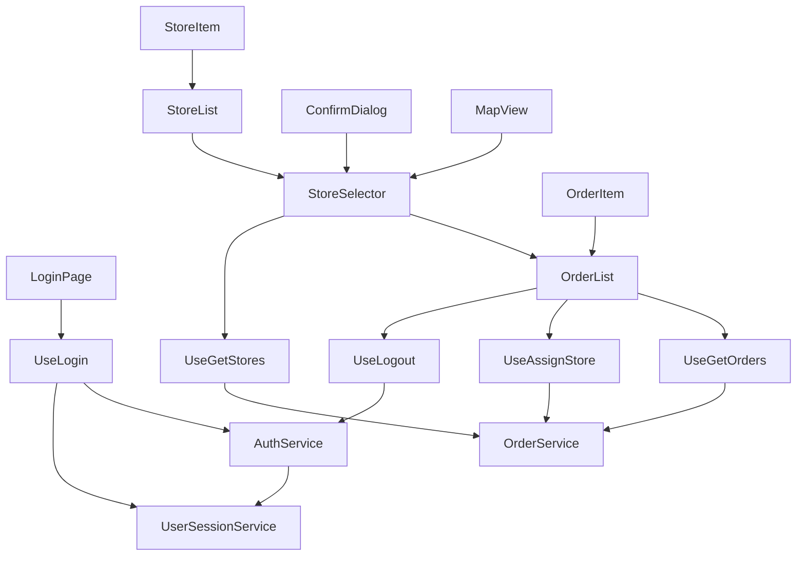
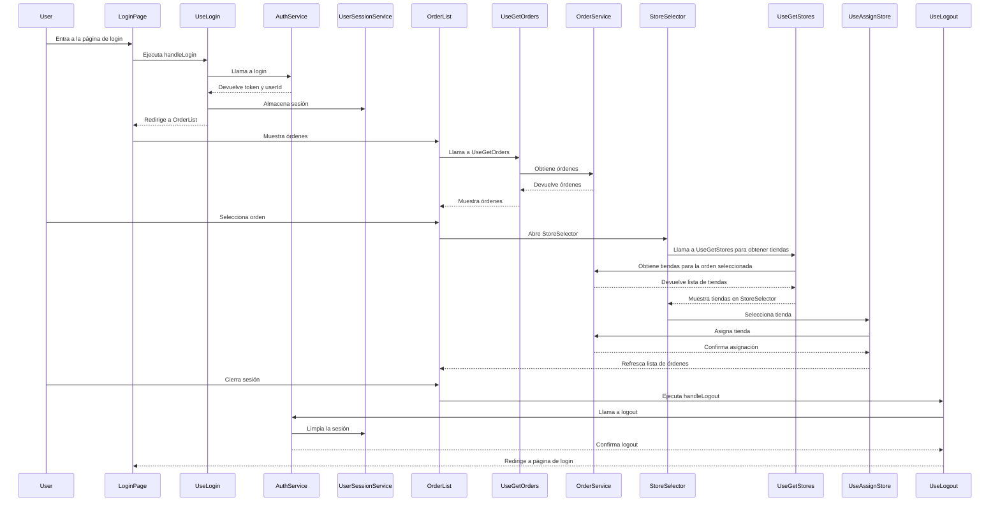
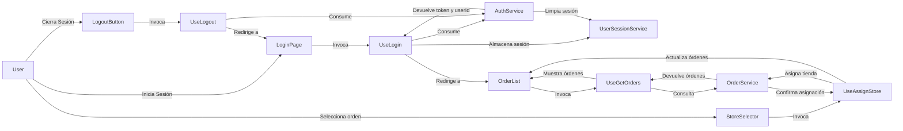

# Cómo Ejecutar

## Prerrequisitos

- Node.js (versión 14.x o superior)
- npm
- Git

## Clonar el Repositorio

- Clona el repositorio desde GitHub
- Cambia a la rama de desarrollo (development)

## Instalación de Dependencias

- Instala las dependencias del proyecto

## Configuración del Entorno

- Configura las variables de entorno (puedes usar las de .env.example)

## Ejecutar la Aplicación

- Inicia el servidor de desarrollo: "npm run start"
- Abre la aplicación en tu navegador: Por defecto, la aplicación estará disponible en http://localhost:3000.

### NOTA: en el servicio "OrderService" en cada metodo esta comentada la parte que retorna la info que esta quemada, esto con el fin de que corran los tests. Para retornar info solo es quitar los comentarios

## Ejecutar Pruebas

- Para ejecutar los tests unitarios: "npm run test"

### NOTA: en el servicio "OrderService" en cada metodo debe estar comentada la parte que retorna la info que esta quemada para la correcta ejecución de las pruebas.

# Preguntas y Respuestas del Challenge

## Preguntas

### Herramientas y Librerías

1. **¿Estás de acuerdo con que utilice Create React App para este proyecto?**
2. **¿Puedo usar librerías de componentes como MUI?**

### Criterios de Ordenación

3. **¿Hay algún criterio para ordenar la lista de tiendas?**

### Requisitos Funcionales Adicionales

4. **¿Hay algún requisito funcional adicional que no esté especificado en el documento, pero que deba tener en cuenta?**
   (por ejemplo, la vista que va antes de las tiendas más cercanas o una vista de detalle)

### Actualización de Datos

5. **¿Puedo asumir que la lista de tiendas será estática o hay planes para agregar funcionalidad de actualización en tiempo real?**
   (por ejemplo, si alguna tienda cierra)

### Simulación de Errores

6. **¿Es necesario simular errores de red o datos inconsistentes para probar la aplicación?**
   (por ejemplo, si falla la petición al backend o si hay error en los datos de respuesta)

### Diseño y Arquitectura

7. **¿Existen pautas específicas de diseño o arquitectura que la empresa siga y que deba considerar en mi implementación?**
8. **¿Podrías dar más contexto sobre cómo debería abordar la seguridad de la aplicación en este desafío?**

### Control de Versiones

9. **En cuanto a las ramas, ¿hay alguna convención particular que deba seguir para los mensajes de commit o las pull requests?**
10. **¿Hay algún ejemplo de archivo markdown para documentar bloqueos que pueda seguir?**

### Video de Demo

11. **¿Qué aspectos específicos te gustaría que destaque en el video de la demo?**

## Respuestas

1. **No hay restricción de librerías.**
2. **Considera el orden, con el parámetro logístico que para ti sea más relevante.**
3. **No hay requisitos funcionales exactos, considera que yo soy tu cliente y te doy el problema. Toda la interfaz que consideres útil para resolverlo está por tu cuenta.**
4. **Es interesante si contemplas real time, pero no es restrictivo.**
5. **Los casos de error siempre son buenos tenerlos en cuenta.**
6. **No hay pautas exactas de diseño, queremos ver las tuyas.**
7. **Me parece interesante esta pregunta, pero por ahora déjame ver cuál es la convicción que mejor te parece.**
8. **Es una demo, puedes ir sobre cualquier cosa apreciable en la interfaz.**

# Arquitectura

## Diagrama de componentes

## Diagrama de secuencia

## Diagrama de flujo de datos

